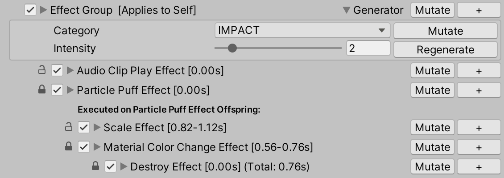

# Squeezer - (formerly Game Feel Descriptions)
A tool for generating, attaching and executing Juice effects in Unity.

- React to Collisions, Movement, custom events and more, and execute sequences of effects, that can be generated based on event type, or manually edited.
- Includes an effect based on an SFXR variant usfxr (https://github.com/zeh/usfxr), for sound effects.
- Implements tweening and easing logic to handle executing tween effects based on the https://github.com/prime31/ZestKit library.
- Implements basic particle effects (three different types), flash, color, and transform effects (position, rotation, scale, shake, wiggle, wobble) as well as time manipulation effects.

[More details under Assets/GameFeelDescriptions](Assets/GameFeelDescriptions/)

Please note that the current version has saving data for studying usage enabled (it tracks any changes and saves them locally), this can be disabled by changing the value of saveDataForUserStudy to false in [GameFeelDescription.cs](/Assets/GameFeelDescriptions/Scripts/Core/GameFeelDescription.cs)

### [Effect Sequence Generator](Assets/GameFeelDescriptions/Scripts/Core/EffectGenerator.cs)

In [Squeezer - A Tool for Designing Juicy Effects](https://doi.org/10.1145/3383668.3419862) we identified and proposed the idea of generating effect sequences based on different categories. We started out with SFXR's eight categories of effects but removed Blip/Select, Coin/Pickup and Power-up. We limited the Squeezer categories to a set of simple arcade game mechanics, that suited our test cases. We added two new options: Player Move and Projectile Move. Meant for continuous triggers and have no counterpart in SFXR. Finally we renamed some of them to make their use clearer. The set of categories is a starting point for effect sequence generation, and we expect this list to be expanded in the future. In the end we ended up with the following content categories (SFXR name on the left, Squeezer name on the right):
    
- Random      -> Random
- Explosion   -> Destroy/Explode}
- Jump        -> Jump}
- Laser/Shoot -> Shoot}
- Hit/Hurt    -> Impact}
- N/A         -> Projectile Move}
- N/A         -> Player Move}

[Inspector Generator](Showcase/InspectorGenerator.png) (seen above) shows the generator interface, where the category and intensity can be selected. The intensity value controls size, severity and sound volume, on a scale between one and ten (where one is the least intense). The intensity scale is split internally into four levels, [1-3] is low intensity variations, [4-6] is medium intensity, [7-9] is high intensity, and [10] is extreme intensity. The different intensity levels, have slightly altered effect sequences for some categories, but otherwise scale parameters linearly.

#### Generation, Mutation and Evolution

We handcrafted base sequences for each category. These sequences are the foundation of the generator. In the generator effects are initialized with parameters randomized within predefined ranges. This allows Squeezer to generate distinct effects with reasonable initial values. 

Additionally, the sequences themselves are mutated at initialisation by randomly adding and removing effects in the sequence. The idea is that even significant mutations maintain some traits from the base sequence of the specified category. The logic for mutating effect trees combines genetic programming's tree mutations with effect parameter mutations. This means that when mutating the effect sequence, a control parameter is used as a probability measure for adding or removing effects to the tree. While mutating each individual effect, the control parameter controls the probability that a value changes and how much it should be adjusted.

However, Squeezer is a design tool, and that means having a designer in the loop to determine fitness and guide the mutations along. To assist in this process, the user interface offers a locking mechanism (The padlock icons in [Inspector Generator](Showcase/InspectorGenerator.png) image indicate which elements are locked). Locked effects will not be mutated or removed while the rest of the tree gets mutated. This allows designers to `freeze' parts of the effect sequence they like while evolving the remaining tree (one-armed bandit style). Designers can use this functionality and repeatedly mutate selected parts of the effect tree, gradually homing in on a final result.

## Papers

Mads Johansen, Martin Pichlmair, and Sebastian Risi. 2020. Squeezer - A Tool for Designing Juicy Effects. In Extended Abstracts of the 2020 Annual Symposium on Computer-Human Interaction in Play (CHI PLAY '20). Association for Computing Machinery, New York, NY, USA, 282–286. DOI:https://doi.org/10.1145/3383668.3419862

